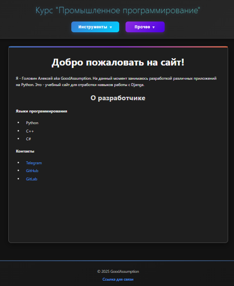

# Мой Django-сайт


Это мой личный сайт-портфолио и площадка для экспериментов, созданный на Django в рамках школьного проекта. Здесь собраны разные утилиты, небольшие веб-приложения и просто забавные штуки.



## 🧰 Что внутри?

На сайте можно найти различные модули, например:

* **Умный текстовый помощник** с функцией копирования.
* **Кастомный видеоплеер** с управлением громкостью и скрытым режимом работы.
* Просто интересные или забавные страницы, сделанные для практики.

Сайт постоянно развивается, и здесь может появиться что-то новое.

## 🚀 Как запустить у себя?

Проект использует стандартный стек Django, поэтому запустить его очень просто.

1. **Клонируйте репозиторий:**

    ```bash
    git clone https://gitlab.informatics.ru/goodassumption/django.git
    cd django
    ```

2. **Создайте и активируйте виртуальное окружение (рекомендуется):**

    ```bash
    python -m venv venv
    # Для Linux/Mac:
    source venv/bin/activate
    # Для Windows:
    venv\Scripts\activate
    ```

3. **Установите зависимости:**

    ```bash
    pip install -r requirements.txt
    ```

    *(Если файла `requirements.txt` нет, установите Django: `pip install django`)*

4. **Запустите сервер для разработки:**

    ```bash
    python manage.py runserver
    ```

5. **Откройте сайт в браузере:** Перейдите по адресу [http://127.0.0.1:8000/](http://127.0.0.1:8000/).

## 📁 Структура проекта

```text
django/
├── server/ # Основной конфигурационный проект Django
│ ├── settings.py # Настройки
│ ├── urls.py # Главная таблица маршрутов
│ └── ...
├── django_first/ # Основное приложение с утилитами
│ ├── templates/ # HTML-шаблоны
│ │ ├── index.html # Главная страница
│ │ └── ...
│ ├── static/ # CSS, JS, изображения, видео
│ ├── views.py # Логика страниц
│ └── ...
├── manage.py # Скрипт для управления проектом
└── README.md # Этот файл
```

## 🛠️ Технологии

* **Backend:** Python 3, Django
* **Frontend:** HTML, CSS (стили в шаблонах), немного JavaScript
* **База данных:** SQLite (по умолчанию в Django)

## 💡 Идеи для будущего

Если захочется развивать проект дальше, сюда можно добавить:

* Блог или раздел с постами.
* Генератор случайных мемов или цитат.
* Мини-игры в браузере.
* Интеграцию с каким-нибудь внешним API (погода, курсы валют).
* Систему комментариев или гостевую книгу.

---

## 📄 Лицензия

Этот проект распространяется под лицензией [**GNU Affero General Public License v3.0**](./LICENSE).

*Проект создан в учебных целях. Код открыт для ознакомления.*
